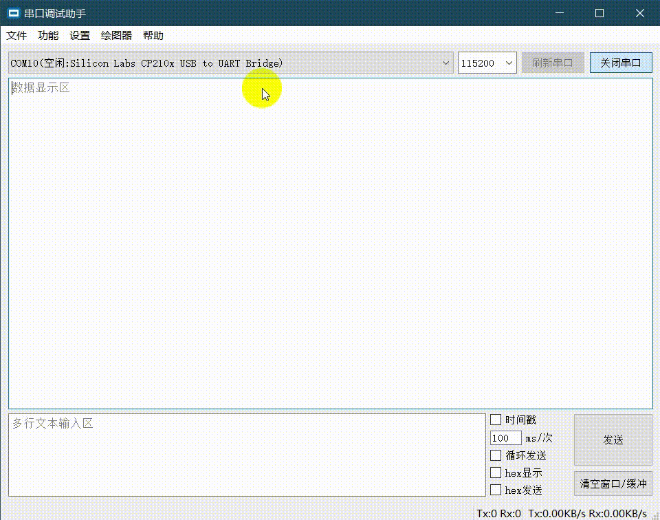

# 纸飞机串口调试助手
  一个基于QT的串口调试助手，实现了基本收发功能、绘图功能、数据保存、关键字高亮、FFT显示等功能，并支持STM32F1和F4系列的自动下载。

# 特色功能
  - 数据实时绘图
  - 数值表格显示
  - 关键字高亮
  - 文本分类显示
  - 实时FFT显示
  - 全局弹出热键
  - 发送注释, 多命令处理
  - STM32串口ISP下载

# 动图展示

# 如何绘图
当打开绘图器后，按照如下协议发送数据即可绘制曲线：
```c
//ASCII格式协议(plotter字符是自定义名字可以任意修改)
#define PLOT(fmt, ...) \
        printf("{plotter:"##fmt"}\n", __VA_ARGS__)
//几条曲线就几个变量。
PLOT("%f,%f", data1, data2);
```

# 如何使用分类文本显示
```c
//语法
"{name:text_data}\n"
```
name为文本名称

text_data为文本数据

不同name的文本数据会显示在不同文本窗口
```c
//C语言示例

#define PRINT_VOL(fmt, ...) \
        printf("{voltage:"##fmt"}\n", __VA_ARGS__)

#define PRINT_CUR(fmt, ...) \
        printf("{current:"##fmt"}\n", __VA_ARGS__)

    float vol = 3.32;
    float cur = 0.23;
    void fun()
    {
      PRINT_VOL("the voltage is %.2f V", vol);
      PRINT_CUR("the current is %.2f A", cur);
    }
```



# 计划清单
  - 代码重构/优化/注释
  
# 考虑中的功能
  - 自定义正则匹配：显示窗口只显示包含匹配字符的数据（数据以\n作为分隔符）
  - XYZModen协议支持
  - 标签页可拖出来单独形成窗口，拖进去自动组合。
  - 信息发布功能可针对版本号发布信息，更具有目标性
  - 自定义高亮规则

# 奇思妙想
  - 布尔控件、滑动条控件显示
  - 绘图器游标功能与差值显示
